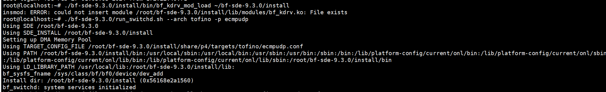
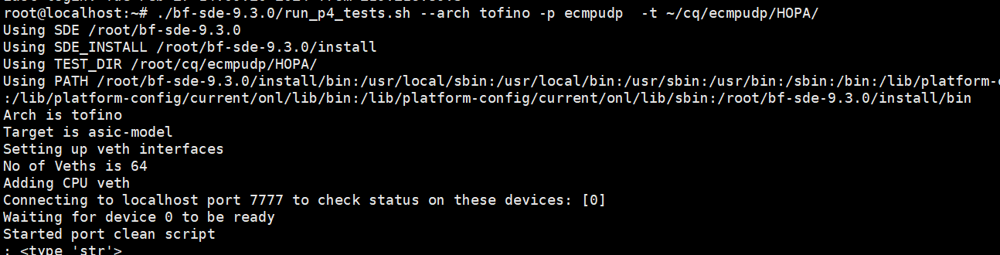
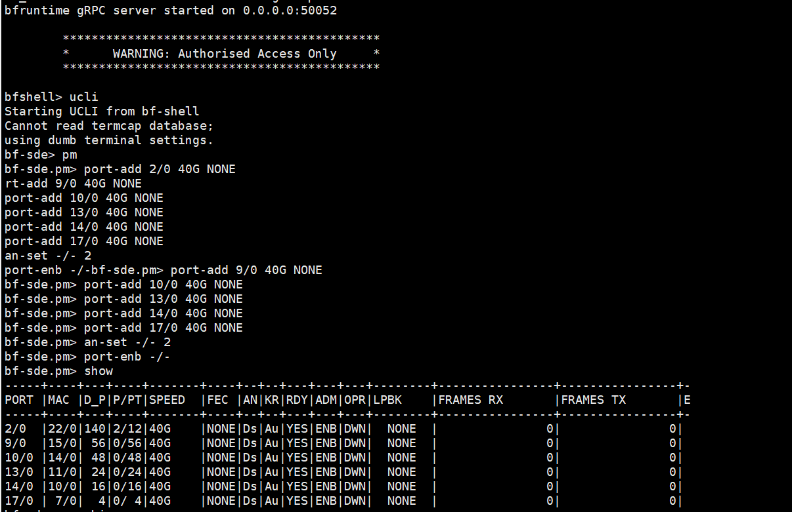
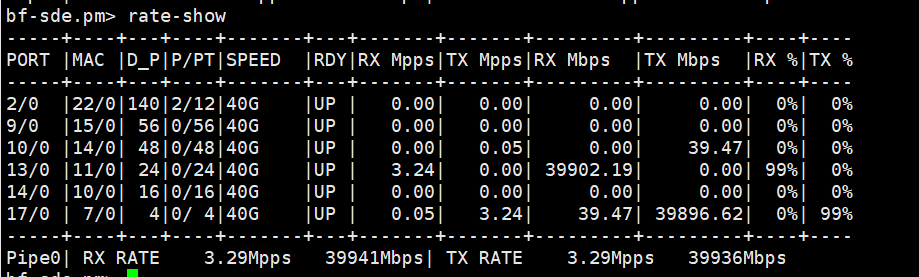

**Repath DPU数据平面代码备份**

代码实现简单逻辑，不涉及DOCA FLOW硬件API调用。目前的内容：主线程 + 发控制报文的线程(后续删除) + 转发数据报文的线程。


-----------------------------------------手动分界线-----------------------------------------------------------

**常用命令**


***P4简单使用***
```
交换机2 & 交换机3
./bf-sde-9.3.0/install/bin/bf_kdrv_mod_load ~/bf-sde-9.3.0/install                //装载内核模块
./bf-sde-9.3.0/run_switchd.sh --arch tofino -p ecmpudp                            //启动p4程序
./bf-sde-9.3.0/run_p4_tests.sh --arch tofino -p ecmpudp  -t ~/cq/ecmpudp/HOPA/    //下表
ucli
pm

port-add 2/0 40G NONE
port-add 9/0 40G NONE
port-add 10/0 40G NONE
port-add 13/0 40G NONE
port-add 14/0 40G NONE
port-add 17/0 40G NONE
an-set -/- 2
port-enb -/- 

rate-period 1
rate-show
```

打开两个终端
终端1 加载模块+启动P4程序


终端2 加载流表


终端1 加载端口配置


终端1 最终效果iperf打一条流


***网卡工具***
```
lshw -class network
ethtool
```
***巨页***
```
echo 4096 > /sys/kernel/mm/hugepages/hugepages-2048kB/nr_hugepages
lsb_release -a 显示系统版本
```
***notice***
```
太网帧尾部的帧校验序列（Frame Check Sequence, FCS）4 字节 
```
***SF***
```
/opt/mellanox/iproute2/sbin/mlxdevm port add pci/0000:03:00.1 flavour pcisf pfnum 1 sfnum 4
/opt/mellanox/iproute2/sbin/mlxdevm port function set pci/0000:03:00.1/294945 hw_addr 00:00:00:00:04:0 trust on state active

devlink dev show
```
***OVS操作***
```
cq dpu
pci 03:00.1上两个sf
en3f1pf1sf5
en3f1pf1sf6
打印现有网桥
ovs-vsctl show
删除网桥
ovs-vsctl del-br hlx
增加网桥
ovs-vsctl add-br hlx_bridge1
删除端口
ovs-vsctl del-port bridge1 p1
增加端口
ovs-vsctl add-port bridge2 p1
查看、增加、删除流表
ovs-ofctl dump-flows ovsbr2
PKTGEN速率不正常
sudo ovs-ofctl del-flows ovsbr1
sudo ovs-ofctl add-flow ovsbr1 "in_port=p0 action=pf0hpf"
sudo ovs-ofctl add-flow ovsbr1 "in_port=pf0hpf action=p0"

sudo ovs-ofctl add-flow ovsbr2 "in_port=p1 action=en3f1pf1sf0"
sudo ovs-ofctl add-flow ovsbr2 "in_port=en3f1pf1sf0 action=p1"
```
***pktgen简单使用***
```
启动
/home/markchen/markchen/work/SPLB/dpdk/pktgen-dpdk-pktgen-21.11.0/build/app/pktgen -a 01:00.1 -- -m [1:2].0 -P
yy->cq

set 0 dst ip 192.168.200.2
set 0 src ip 192.168.200.1/24
set 0 dst mac a0:88:c2:32:06:6a
set 0 size 1000
start 0


set 0 dst ip 192.168.201.2
set 0 src ip 192.168.204.1/24
set 0 dst mac set 0 dst ip 192.168.201.2
set 0 src ip 192.168.204.1/24
set 0 dst mac 08:c0:eb:bf:ef:82
set 0 size 1000
start 0
set 0 size 1000
start 0

# start min max inc

enable 1 range
range 1 size 1086 1086 1086 0
range 1 dst ip 192.168.200.200 192.168.200.200 192.168.200.200 0.0.0.0
range 1 src port 1 2 3 1 
range 1 dst port 5001 5001 5001 0
range 1 dst mac  b8:ce:f6:d5:d6:f8 b8:ce:f6:d5:d6:f8 b8:ce:f6:d5:d6:f8 00:00:00:00:00:00
start 1


也可以部署脚本，推荐pkt不是lua，因为简单
脚本
#/bin/bash

pktgen -l 0-6 -n 3  --proc-type auto -- -P -m "[1:3].0, [2:4].1,[5:6].3" -f dpdk.pkt

```

***安装DPDK以及一些命令***

```
DPDK
pkg-config --modversion libdpdk

[DPU上安装DPDK]("https://www.cnblogs.com/JoshuaYu/p/17612711.html")
选择使用哪个dpdk，把需要的路径加入到其中
export PKG_CONFIG_PATH=/usr/local/lib/x86_64-linux-gnu/pkgconfig:$PKG_CONFIG_PATH
export PKG_CONFIG_PATH=/opt/mellanox/dpdk/lib/aarch64-linux-gnu/pkgconfig:$PKG_CONFIG_PATH

重放PCAP文件
pktgen -a 01:00.1 -- -m [1:2].0 -P -s 0:replay.pcap

conda update --all 更新python包

```

***服务器开启交换机***

```
登录CX103服务器
sudo minicom -s
选择带有as dfl的选项回车
exit
Ctrl s 或者Ctrl a/ b/c  (我没用上）
密码:0penBmc    (我没用上）
出现如下界面后

输入以下两条命令
echo 0 > /sys/class/i2c-adapter/i2c-12/12-0031/pwr_main_n
echo 1 > /sys/class/i2c-adapter/i2c-12/12-0031/pwr_main_n; sol.sh
等运行完毕，界面如下

输入P4交换机的用户名和密码
打开交换机

```


