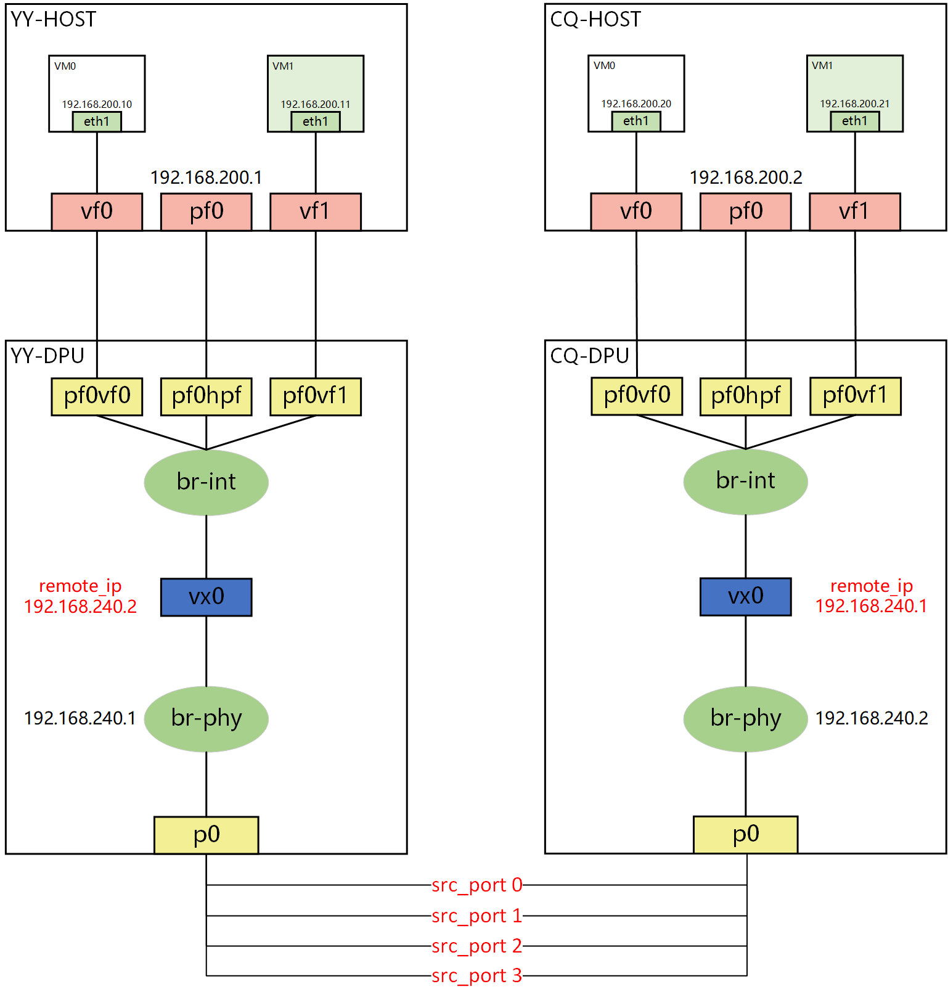

# [BlueField-2 DPU]KVM网卡直通+VxLAN配置

## 1 申请VF

- 保证SR-IOV已经配置

[HowTo-Configure-SR-IOV-for-ConnectX-4-ConnectX-5-ConnectX-6-with-KVM-Ethernet](https://enterprise-support.nvidia.com/s/article/HowTo-Configure-SR-IOV-for-ConnectX-4-ConnectX-5-ConnectX-6-with-KVM-Ethernet)

- 申请VF

A. 以下的 `enp1s0f1np1` 即 `DPU` 的 `pf1`

```bash
# 先清空pf的vf
echo 0 > /sys/class/net/enp1s0f1np1/device/sriov_numvfs
# 申请两个新的vf
echo 2 > /sys/class/net/enp1s0f1np1/device/sriov_numvfs
```

B. 查看 `pci` 进行验证

```bash
root@markchen-OptiPlex-7090:/home/zy# lspci | grep Virtual
01:02.3 Ethernet controller: Mellanox Technologies ConnectX Family mlx5Gen Virtual Function (rev 01)
01:02.4 Ethernet controller: Mellanox Technologies ConnectX Family mlx5Gen Virtual Function (rev 01)
```

`HOST` 中出现了 `enp1s0f1v0` 和 `enp1s0f1v1`

`DPU` 中也出现了对应的代表口 `representor` : `pf1vf0` 和 `pf1vf1`

## 2 KVM网卡直通

- 分离PCI设备

A. 识别相应 `pci` 设备

```bash
virsh nodedev-list --tree | grep pci
```

B. 获取 `pci` 设备的 `xml` 参数，记住其中的 `bus` , `slot` , `function` 值

```bash
virsh nodedev-dumpxml pci_0000_01_02_3
```

C. `detach` 设备

```bash
virsh nodedev-dettach pci_0000_01_02_3

# 恢复命令
# virsh nodedev-reattach pci_0000_01_02_3
```

D. 修改 `VM` 配置文件

```bash
# 查看当前KVM VM列表，找到需要修改的VM名称
 virsh list --all
# 先关闭VM
 virsh shutdown vm_name
# 编辑VM配置文件
 virsh edit vm_name
```

D. 修改虚拟机 `xml` 文件，添加一个 `pci` 设备 (将 `dumpxml` 查询到的 `bus` , `slot` , `function` 填入）

```bash
<devices>
......
<hostdev mode='subsystem' type='pci' managed='yes'>
 <source>
   <address domain='0x0000' bus='0x01' slot='0x02' function='0x03'/>
 </source>
</hostdev>
......
</devices>
```

E. 开启 `VM`

```bash
virsh start vm_name
```

## 3 配置VxLAN

- 拓扑
  



- CQ-DPU ARM上OVS_DPDK构建拓扑,YY同理 (以p0为例)
  

```bash
# 创建br-int网桥
./ovs-vsctl --may-exist add-br br-int \
-- set Bridge br-int datapath_type=netdev \
-- br-set-external-id br-int bridge-id br-int \
-- set bridge br-int fail-mode=standalone 

# 向br-int网桥添加pf0hpf 
./ovs-vsctl add-port br-int pf0hpf \
-- set Interface pf0hpf type=dpdk options:dpdk-devargs=0000:03:00.0,representor=[65535]

# 向br-int网桥添加pf0vf0 
./ovs-vsctl add-port br-int pf0vf0 \
-- set Interface pf0vf0 type=dpdk options:dpdk-devargs=0000:03:00.0,representor=[0]

# 向br-int网桥添加pf0vf1 
./ovs-vsctl add-port br-int pf0vf1 \
-- set Interface pf0vf1 type=dpdk options:dpdk-devargs=0000:03:00.0,representor=[1]
# 以上三者应该可以一次性添加,参数 : representor=[0-1,65535]

# 向br-int网桥添加vxlan0,指定remote_ip=192.168.240.1
./ovs-vsctl add-port br-int vxlan0 \
-- set interface vxlan0 type=vxlan options:remote_ip=192.168.240.1

# 创建br-phy网桥,用于解析arp等报文
./ovs-vsctl --may-exist add-br br-phy \
-- set Bridge br-phy datapath_type=netdev \
-- br-set-external-id br-phy bridge-id br-phy \
-- set bridge br-phy fail-mode=standalone \
other_config:hwaddr=08:c0:eb:bf:ef:86

# 向br-int网桥添加p0
./ovs-vsctl --timeout 10 add-port br-phy p0 \
-- set Interface p0 type=dpdk options:dpdk-devargs=0000:03:00.0

# 配置br-phy网桥
ip addr add 192.168.240.2/24 dev br-phy
ip link set br-phy up
iptables -F
```

- 配置VM网络并测试
  

```bash
# 为直通网卡的KVM VM配置ip (VM的HOST为CQ)
ifconfig enp8s0 up 192.168.200.10/24

# 从VM ping YY-HOST
ping 192.168.200.1
```